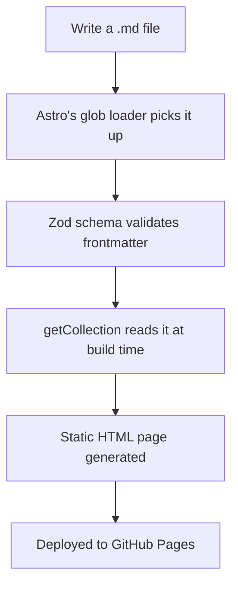

This is the first article on this site — really more of a test that the
content engine works end-to-end than a "real" article.

## Why a flat folder + tags?

Instead of one folder per topic (`android/`, `space/`, ...), every
article lives in the same `src/content/articles/` folder. Topic is just a
`tags` field in the frontmatter above. That means a single article can
belong to multiple topics without duplicating files or picking one "home"
folder for it.

## How a request flows through the build

That's it — no database, no admin panel, no manual "register this post"
step. Commit a markdown file, push, and the site rebuilds itself.
